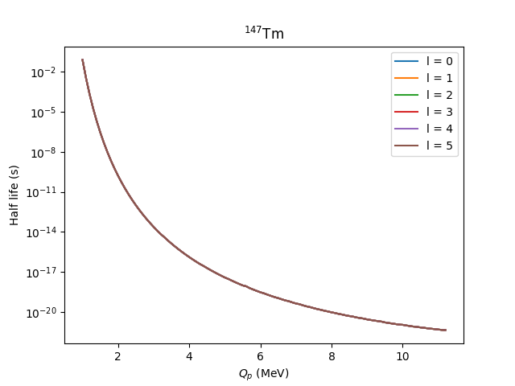
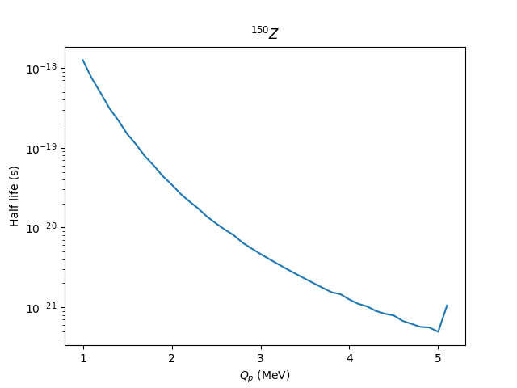

# Project 3
###### Brandon Henke
## 1
```
A = 109, Z = 53, T_1/2 = 2.16E-04 s
A = 112, Z = 55, T_1/2 = 1.42E-03 s
A = 113, Z = 55, T_1/2 = 9.76E-06 s
A = 146, Z = 69, T_1/2 = 1.78E+01 s
A = 146, Z = 69, T_1/2 = 2.56E+00 s
A = 147, Z = 69, T_1/2 = 1.36E+02 s
A = 147, Z = 69, T_1/2 = 1.29E-03 s
A = 150, Z = 71, T_1/2 = 1.32E+00 s
```
## 2



All of these curves look like they decay as $1/x$.

## 3
```
A = 109, Z = 53, Sp = 2.1605831038766365
A = 112, Z = 55, Sp = 2.8483021535997435
A = 113, Z = 55, Sp = 0.5743880558175495
A = 146, Z = 69, Sp = 75.61325428306556
A = 146, Z = 69, Sp = 35.54225417203908
A = 147, Z = 69, Sp = 50.34963428379563
A = 147, Z = 69, Sp = 3.590205235960872
A = 150, Z = 71, Sp = 33.051659558324914
```
For the two $^{147}_{69}$ Tm half lives, the spectroscopic factors found are different.
Since the half life is $\propto 1/S_p$, one can take the average between the two values ($S_p \approx 55.6$) to be the spectroscopic factor for this nucleus.

## 4



This looks similar to the curves shown in problem 2, but with a much shorter half life.
The barrier in this case is only due to the angular momentum, making it much smaller than those in the cases in proton emission, where the Coulomb potential is in effect.
There seemes to be a jump at the end, but the energy for which that jump occurs is very close to the peak of the barrier, so it's most likely some numerical error.